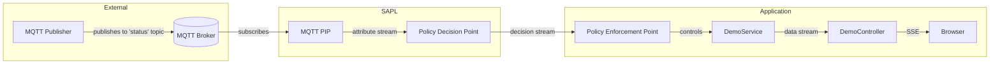

# MQTT Attributes Demo

This demo shows how MQTT can serve as a **Policy Information Point (PIP)** in Attribute Stream-Based Access Control (ASBAC). External events published to an MQTT broker become real-time attribute streams that policies continuously evaluate to make dynamic authorization decisions.

## Running the Demo

```bash
mvn spring-boot:run
```

Then open http://localhost:8080/secured in your browser.

## What You'll See

The `/secured` endpoint streams data as Server-Sent Events (SSE). Access is controlled by an MQTT-based policy:

- **Every 3 seconds**, the system toggles between `"ok"` and `"emergency"` states via MQTT
- **When `"emergency"`**: Data flows to the client
- **When `"ok"`**: Access is denied, and the client receives an "Access Denied" message

The stream **recovers automatically** when the state changes back to `"emergency"` - no page reload required.

## MQTT as a Policy Information Point in ASBAC

In **Attribute Stream-Based Access Control (ASBAC)**, authorization decisions are continuously re-evaluated as attributes change over time. Unlike traditional ABAC where attributes are queried once per request, ASBAC treats attributes as **live streams**.



## The Service with PEP Annotation

The `@EnforceRecoverableIfDenied` annotation wraps the method's return value in a Policy Enforcement Point:

```java
@Service
public class DemoService {

    @EnforceRecoverableIfDenied(subject = "authentication.getName()", 
                                 action = "'read'", 
                                 resource = "'time'")
    public Flux<String> getFluxStringRecoverable() {
        return Flux.interval(Duration.ofMillis(500L))
                .map(i -> String.format("event %d - time %s", i, Instant.now()));
    }
}
```

The annotation parameters become the **AuthorizationSubscription** sent to the PDP:
- `subject`: The authenticated user (SpEL expression)
- `action`: `"read"` 
- `resource`: `"time"`

## The Policy

The policy (`permitOnEmergency.sapl`) subscribes to the MQTT attribute stream:

```
policy "permit on emergency"
permit action == "read" & resource == "time"
where
    "status".<mqtt.messages> == "emergency";
```

The expression `"status".<mqtt.messages>` creates a **subscription** to the MQTT topic. Each time the message changes, the PDP re-evaluates and emits a new decision.

## The Controller with Recovery Handling

```java
@GetMapping(value = "/secured", produces = MediaType.APPLICATION_NDJSON_VALUE)
public Flux<ServerSentEvent<String>> recoverAfterDeny() {
    return recoverWith(service.getFluxStringRecoverable(),
            error -> log.info("Access denied: {}", error.getMessage()),
            () -> ACCESS_DENIED_MESSAGE)
            .map(value -> ServerSentEvent.<String>builder().data(value).build());
}
```

The `RecoverableFluxes.recoverWith()` utility:
1. Logs the access denied event
2. Emits a user-friendly message to the client  
3. Continues streaming when access is granted again

## Key Components

| File                         | Purpose                                                                  |
|------------------------------|--------------------------------------------------------------------------|
| `MqttDataPublisher.java`     | Simulates external events by publishing "ok"/"emergency" every 3 seconds |
| `SaplMqttConfiguration.java` | Registers the `MqttPolicyInformationPoint` bean                          |
| `permitOnEmergency.sapl`     | Policy that permits access only during "emergency" state                 |
| `DemoService.java`           | Service method secured with `@EnforceRecoverableIfDenied`                |
| `DemoController.java`        | REST controller using `RecoverableFluxes.recoverWith()`                  |

## ASBAC Use Cases

ASBAC with MQTT is ideal for scenarios where authorization must react to real-world events:

- **IoT systems**: Grant access based on sensor readings (temperature thresholds, door states)
- **Industrial control**: Allow operations only during specific machine states
- **Emergency systems**: Enable privileged access during alerts
- **Real-time trading**: Adjust permissions based on market conditions
- **Smart buildings**: Control access based on occupancy or environmental data
