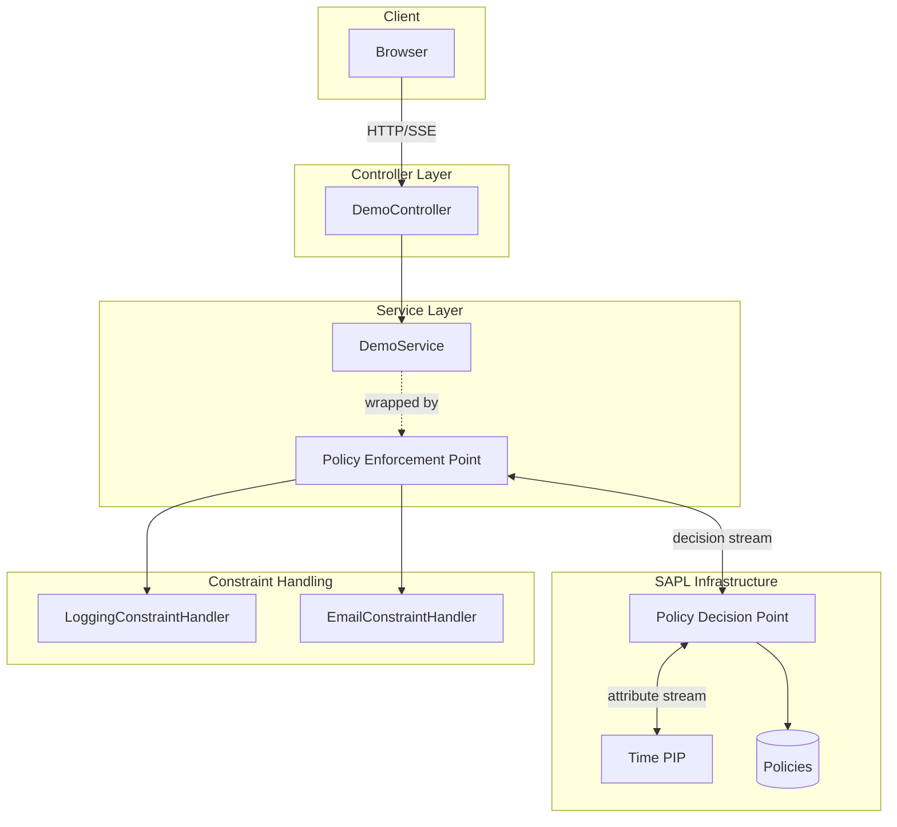
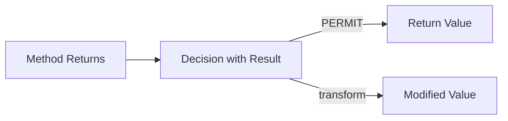
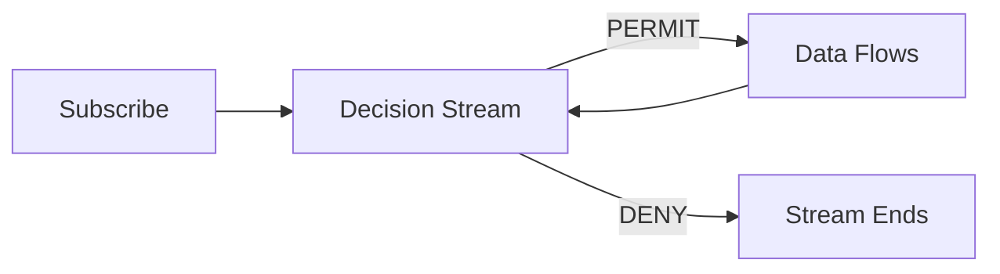
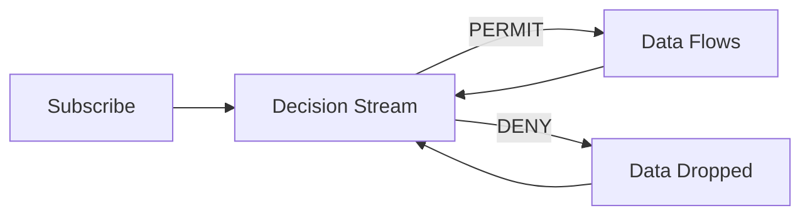
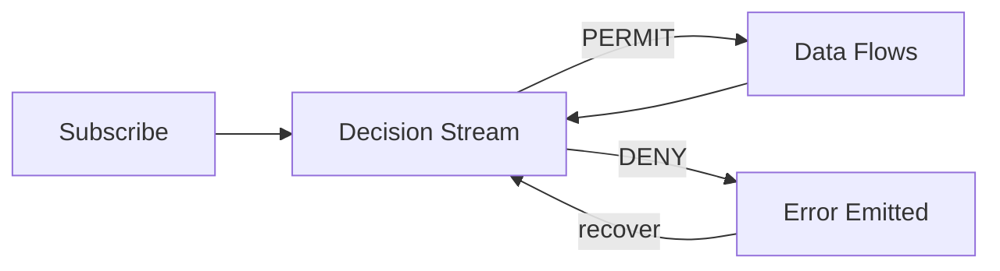

# Demo - Reactive Policy Enforcement Points in Webflux

This demo shows **Attribute Stream-Based Access Control (ASBAC)** in a Webflux API. Unlike traditional access control where decisions are made once per request, ASBAC continuously re-evaluates policies as attributes (like time) change, enabling real-time authorization updates on long-lived reactive streams. SAPL supports both traditional request-response ABAC style authorization and ASBAC authorization. This demo demonstrates different patterns of stream-based access control.

## Running the Demo

```bash
mvn spring-boot:run
```

## Architecture Overview



## Endpoints

| Endpoint                                                                    | Annotation                    | Behavior                                               |
|-----------------------------------------------------------------------------|-------------------------------|--------------------------------------------------------|
| [/numbers](http://localhost:8080/numbers)                                   | `@PreEnforce`                 | SSE stream with constraint handlers on each element    |
| [/string](http://localhost:8080/string)                                     | `@PreEnforce`                 | Single value with argument modification                |
| [/changedstring](http://localhost:8080/changedstring)                       | `@PostEnforce`                | Response transformed by policy                         |
| [/enforcetilldeny](http://localhost:8080/enforcetilldeny)                   | `@EnforceTillDenied`          | Stream terminates on deny                              |
| [/enforcedropwhiledeny](http://localhost:8080/enforcedropwhiledeny)         | `@EnforceDropWhileDenied`     | Messages silently dropped during deny                  |
| [/enforcerecoverableifdeny](http://localhost:8080/enforcerecoverableifdeny) | `@EnforceRecoverableIfDenied` | Client notified on deny, can recover                   |
| [/documents](http://localhost:8080/documents)                               | `@PreEnforce`                 | Flux filtering based on security clearance             |
| [/patients](http://localhost:8080/patients)                                 | `@PreEnforce`                 | JSON content transformation (blacken, delete, replace) |

## Time-Based Access Control

The streaming endpoints use **time as a PIP attribute**. Access changes based on the current second:

| Seconds | Decision | Message            |
|---------|----------|--------------------|
| 0-19    | PERMIT   | "Time < 20"        |
| 20-39   | PERMIT   | "Time < 40"        |
| 40-59   | DENY     | "DENY ! Time < 60" |

Watch the server console to see constraint handler messages change as time progresses.

## The Service Layer with PEP Annotations

```java
@Service
public class DemoService {

    // One-time decision, constraints enforced on each stream element
    @PreEnforce
    public Flux<Integer> getFluxNumbers() {
        return Flux.just(0, 1, 2, 3, 4, 5, 6, 7, 8, 9)
                   .delayElements(Duration.ofMillis(500L));
    }

    // Response can be transformed by policy
    @PostEnforce(resource = "returnObject")
    public Mono<String> getMonoStringWithPreAndPost() {
        return Mono.just("I will be decorated");
    }

    // Stream ends when access denied
    @EnforceTillDenied
    public Flux<String> getFluxString() { ... }

    // Messages dropped silently during deny
    @EnforceDropWhileDenied  
    public Flux<String> getFluxStringDroppable() { ... }

    // Client notified on deny, can choose to stay subscribed
    @EnforceRecoverableIfDenied
    public Flux<String> getFluxStringRecoverable() { ... }
}
```

## The Policies

```
set "demo set"
first-applicable

// Transform the response by wrapping in ***
policy "Change Resource Example"
permit action.http.contextPath == "/changedstring"
transform "***" + resource + "***"

// Time-based policies for streaming endpoints
policy "Time based (1/3)"
permit action.http.contextPath == "/enforcetilldeny" | ...
where time.secondOf(<time.now>) < 20
obligation { "type": "logAccess", "message": "Time < 20" }

policy "Time based (2/3)"  
permit action.http.contextPath == "/enforcetilldeny" | ...
where time.secondOf(<time.now>) < 40
obligation { "type": "logAccess", "message": "Time < 40" }

policy "Time based (3/3)"
deny action.http.contextPath == "/enforcetilldeny" | ...
where time.secondOf(<time.now>) < 60
obligation { "type": "logAccess", "message": "DENY ! Time < 60" }
```

The key ASBAC feature: `<time.now>` is an **attribute stream** that emits new values as time changes. The PDP re-evaluates and emits new decisions, which the PEP enforces in real-time.

## Constraint Handlers

Policies can include **obligations** (must be handled) and **advice** (optional). This demo registers constraint handlers as Spring beans:

```java
@Service
public class LoggingConstraintHandlerProvider implements ConsumerConstraintHandlerProvider<Object> {

    @Override
    public boolean isResponsible(Value constraint) {
        // Handle constraints with type "logAccess"
        return constraint.get("type").equals("logAccess");
    }

    @Override
    public Consumer<Object> getHandler(Value constraint) {
        var message = constraint.get("message").textValue();
        return value -> log.info(message);
    }
}
```

## Handling `@EnforceRecoverableIfDenied`

The `RecoverableFluxes` utility provides clean error handling:

```java
@GetMapping("/enforcerecoverableifdeny")
public Flux<ServerSentEvent<String>> recoverAfterDeny() {
    return recover(service.getFluxStringRecoverable(),
            error -> log.warn("ACCESS DENIED - will resume when permitted"))
            .map(value -> ServerSentEvent.<String>builder().data(value).build());
}
```

| Method                                  | Behavior                                         |
|-----------------------------------------|--------------------------------------------------|
| `recover(flux)`                         | Drop `AccessDeniedException` and continue        |
| `recover(flux, consumer)`               | Execute side-effect (e.g., logging) and continue |
| `recoverWith(flux, supplier)`           | Emit replacement value to client                 |
| `recoverWith(flux, consumer, supplier)` | Side-effect + replacement value                  |

## PEP Annotations

SAPL provides several annotations for securing reactive methods. Each annotation offers different behavior for handling authorization decisions on streams.

### `@PreEnforce`

Makes a single authorization decision before the method executes. For `Flux` return types, the decision is made once at subscription time, then constraints are enforced on each emitted element. Best for streams where the authorization context doesn't change.


### `@PostEnforce`

Evaluates authorization after the method returns, allowing the policy to inspect and transform the result. The `resource` parameter specifies what to expose to the policy (e.g., `"returnObject"`).



### `@EnforceTillDenied`

Continuously re-evaluates authorization as attributes change. When a DENY decision occurs, the stream terminates immediately. The client must reconnect to resume. Use when denied access should be final.



### `@EnforceDropWhileDenied`

Continuously re-evaluates authorization. During DENY periods, data is silently dropped and the client sees nothing but remains connected. When PERMIT resumes, data flows again automatically. Use when temporary access interruptions should be invisible.



### `@EnforceRecoverableIfDenied`

Continuously re-evaluates authorization. On DENY, emits an `AccessDeniedException` that can be caught and handled. Combined with `RecoverableFluxes`, the client can be notified of denied access while the stream continues. Use when clients need explicit notification of access changes.



## Flux Element Filtering

The [/documents](http://localhost:8080/documents) endpoint demonstrates **filtering Flux elements** based on policy constraints. Documents have NATO security classifications, and the policy filters them based on the user's clearance level (simulated via time).

```java
@Service
public class DocumentsService {

    @PreEnforce(genericsType = Document.class)
    public Flux<Document> getDocuments() {
        return Flux.fromArray(documents);
    }
}
```

The `genericsType` parameter tells SAPL the element type for proper constraint handling. The policy uses a custom `FilterPredicateConstraintHandlerProvider`:

```java
@Service
public class FilterClassifiedDocumentsConstraintHandlerProvider
        implements FilterPredicateConstraintHandlerProvider {

    @Override
    public Predicate<Object> getHandler(Value constraint) {
        var clearance = NatoSecurityClassification.valueOf(
            constraint.get("clearance").textValue());
        return doc -> ((Document) doc).classification().compareTo(clearance) <= 0;
    }
}
```

| Seconds | Clearance Level | Documents Visible        |
|---------|-----------------|--------------------------|
| 0-19    | RESTRICTED      | Unclassified, Restricted |
| 20-39   | TOP SECRET      | All documents            |
| 40-59   | UNCLASSIFIED    | Only unclassified        |

## JSON Content Transformation

The [/patients](http://localhost:8080/patients) endpoint demonstrates **transforming JSON content** within Flux elements. Patient records are modified based on policy--fields can be blackened, deleted, or replaced.

```java
@Service
public class PatientsService {

    @PreEnforce
    public Flux<Patient> getPatients() {
        return Flux.fromArray(PATIENTS);
    }
}
```

The policy uses the built-in `filterJsonContent` constraint handler:

```
policy "Patient Data (1/3)"
permit action.java.name == "getPatients"
where time.secondOf(<time.now>) < 20
obligation {
    "type": "filterJsonContent",
    "actions": [
        { "type": "blacken", "path": "$.icd11Code", "discloseLeft": 2 },
        { "type": "delete", "path": "$.diagnosis" }
    ]
}
```

| Seconds | ICD Code                    | Diagnosis              |
|---------|-----------------------------|------------------------|
| 0-19    | Blackened (2 chars visible) | Deleted (null)         |
| 20-39   | Replaced with stars         | `[DIAGNOSIS HIDDEN]`   |
| 40-59   | Full code visible           | Full diagnosis visible |

## Method Argument Modification

The [/string](http://localhost:8080/string) endpoint demonstrates **modifying method arguments** via policy obligations. The constraint handler appends text to the input before the method executes.

```java
@Service
public class StringService {

    @PreEnforce
    public Mono<String> lowercase(String aString) {
        return Mono.just(aString.toLowerCase());
    }
}
```

The policy adds a suffix via obligation:

```
policy "modify string arguments"
permit action.http.contextPath == "/string"
obligation { "suffix": "HELLO MODIFICATION" }
```

A custom `MethodInvocationConstraintHandlerProvider` modifies the arguments:

```java
@Service
public class StringArgumentModificationConstraintHandlerProvider
        implements MethodInvocationConstraintHandlerProvider {

    @Override
    public Consumer<ReactiveSaplMethodInvocation> getHandler(Value constraint) {
        return invocation -> {
            var suffix = constraint.get("suffix").textValue();
            var args = invocation.getArguments();
            args[0] = args[0] + " " + suffix;
        };
    }
}
```

## Key Files

| File                                                      | Purpose                                      |
|-----------------------------------------------------------|----------------------------------------------|
| `DemoService.java`                                        | All PEP annotation types demonstrated        |
| `DemoController.java`                                     | REST endpoints with SSE streaming            |
| `demo_set.sapl`                                           | Time-based policies with obligations         |
| `DocumentsService.java`                                   | Flux filtering by security classification    |
| `classified_documents.sapl`                               | Clearance-based filtering policy             |
| `FilterClassifiedDocumentsConstraintHandlerProvider.java` | Custom filter predicate handler              |
| `PatientsService.java`                                    | JSON content transformation demo             |
| `patients.sapl`                                           | Blacken/delete/replace transformation policy |
| `StringService.java`                                      | Argument modification demo                   |
| `argumentmodification.sapl`                               | Argument modification policy                 |
| `LoggingConstraintHandlerProvider.java`                   | Handles "logAccess" constraints              |
| `SecurityConfiguration.java`                              | Enables `@EnableReactiveSaplMethodSecurity`  |
